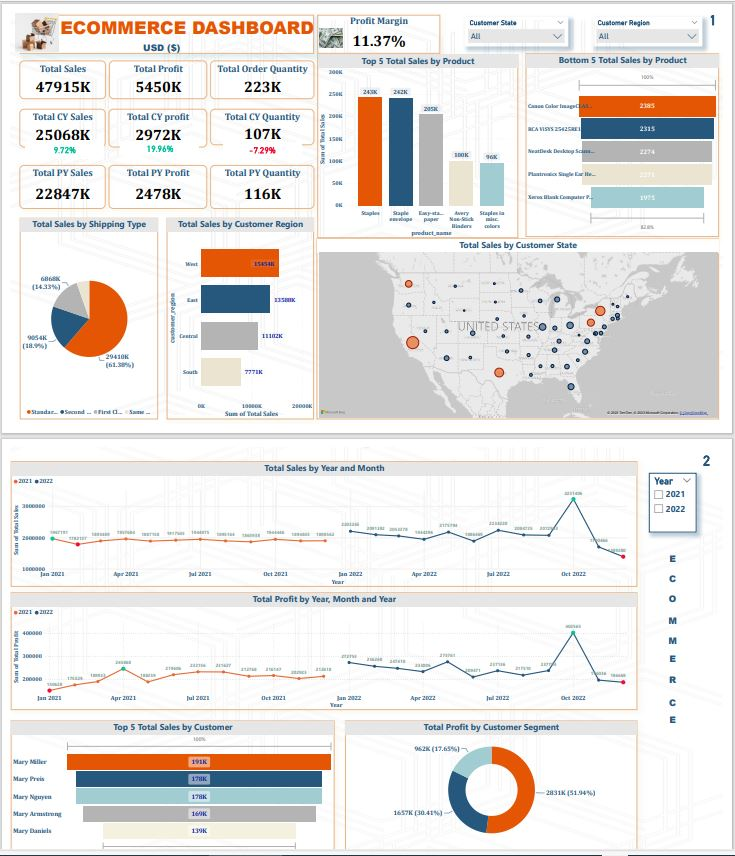

# E_commerce_sales_analysis

This project covers the Ecommerce analysis of an organization's products and its customers in different states and regions in the United States in 2021 and 2022, presenting a YTD analysis.

Our client needs to analyse and oversee its sales and marketing process effectively. The client’s demand was to create an e commerce analysis dashboard for the year 2021 and 2022 so they can have insights on the following:

·Year-to-Date (YTD) sales, profit, quantity sold, profit margin.

·Find the sales performance by each state

·Top 5 and bottom 5 products by sales

·Sales by region to know best and worst performing region all over the country

·Sales by shipping type to get the best shipping type percentage

·Total Sales Trend by Year and Month for 2021 and 2022

·Total Profit Trend by Year and Month for 2021 and 2022

·Top 5 Total Sales by Customer

·Total Profit by Customer Segment

INSIGHTS

The top 5 products with the highest sales are staples $242,271, staple envelopes $241,675, easy staple paper $204,567, avery-non-stick binder $100,135, and staples in misc colors $96,287 while

The bottom 5 products with the lowest sales are canon MF8580Cdw $2,385, RCA ViSYS 25423RE1 Corded phone $2,315,  NeatDesk Desktop Scanner & Digital Filing System $2,274, Plantronics Single Ear Headset $2,271, and Xerox Blank Computer paper $1,975.

The top customer region with the highest total sales is the west with $15,454,324 (32.25%) of the 4 regions followed by the east  $13,587,719 (28.35%).  Therefore, an effective marketing strategy should focus on these regions for marketing strategy to hit the desired goals of increasing sales and maximizing profit.

Furthermore, Customers from California had the highest sales made in both 2021 and 2022 totalling $9,672,991 followed by other top 4 states namely  Texas $4,765,933, New York $5,335,097, Pennsylvania $2,844,375, and Washington $2,425,581. These 5 states totalled 52.26%, slightly over half of the total 49 states, which further emphasizes the need to direct more marketing strategies at these top 5 states to maximise sales and profit.

Lastly, going by total sales and total profit trend for the year 2021 and 2022 across January to December. There was almost an even distribution in total sales for 2021 with total sales being at the highest in January $1,967,191 and February being the lowest $1,782,137 whereas highest total sales was made in October for the year 2022 at $3,231,406 and lowest in December $1,389,280.

April had the highest profit $245,868 in the year 2021 and a high drop in January having total sales of  $150,628 while in the year 2022, highest total profit was made in the month of October $402,565, and the lowest profit at $186,669 in the month of December.
